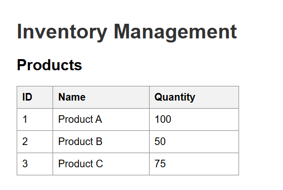
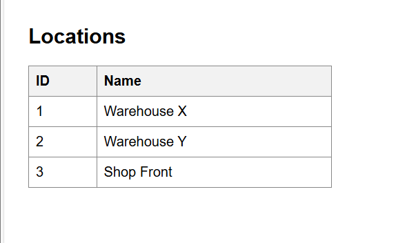

Inventory Management Web Application (Flask)

This is a very simple inventory management project built using Flask and SQLite.
It shows two tables:

---Products with their quantities
---Locations

The focus is on keeping it beginner-friendly and easy to understand:-
Features:
      View products and their quantities
      View available locations
      Simple and clean HTML table display
      Easy to set up and run

Screenshots:
Products Table:
      

Locations Table:
      
